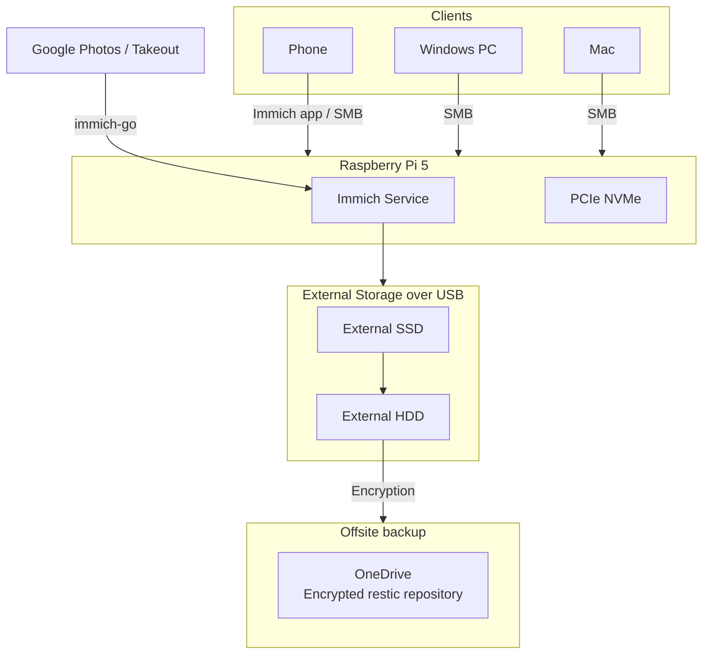

# Safe self hosted image storage setup with redundancy

## Backstory
It all started because I got tired of being bullied by constant notifications due to aggressive upselling that I'm running out of space (even though I was on 85%). It was not even about the money, more about dark patterns trying to use fomo to make me pay even more. I decided enough is enough and came up with the idea of self hosting my photos with additional benefits such as network storage, steam link server, remotely accessed computer and of course - not paying to the big corporation. And also nothing is trained on my personal stuff.

This document describes a setup for moving away from Google Photos and running [Immich](https://immich.app/) on a Raspberry Pi 5 (probably 4 would do too, but using nvme was so much easier - which i wanted for system files and as one of network accessed storages) with separate storage layers.

The goal is to keep the setup simple, fast, and recoverable.

## Table of Contents
- [Architecture overview](#architecture-overview)
- [What goes where](#what-goes-where)
- [Requirements](#requirements)
- [Step 0: Prerequisites](#step-0-Prerequisites)
- [Step 1: Prepare and mount the disks](#step-1-prepare-and-mount-the-disks)
- [Step 2: Install the required software](#step-2-install-the-required-software)
- [Step 3: (optional): Configure Samba](#step-3-optional-configure-samba)
- [Step 4: Install and configure Immich](#step-4-install-and-configure-immich)
- [Step 5: Import Google Photos with immich-go](#step-5-import-google-photos-with-immich-go)
- [Step 6: Backup strategy](#step-6-backup-strategy)
- [Step 7: Create the backup script](#step-7-create-the-backup-script)
- [Step 8: Schedule the backup](#step-8-schedule-the-backup)
- [Step 9: (optional) Swap increase on Raspberry Pi](#step-9-optional-swap-increase-on-raspberry-pi)
- [Conclusion](#conclusion)
- [TODO](#todo)

## What will you need?
Down below you can find the complete set of parts that I used to set this up. In parentheses I will emphasize why its used, so you will decide if for you its needed.

Of course details like storage capacity or brand is completely up to you, but you could refer to my choices in the parentheses.

### Hardware
- Raspberry Pi 5
- PCIe NVMe storage (256GB)
- External USB SSD (Sandisk 1TB)
- External USB HDD (Seagate 10 TB - I made sure before hand that its CMR)

> [!TIP]
> Avoid SMR drives for large backup workloads because sustained write performance can collapse during heavy sync operations (as far as I learned higher capacities 10tb+ usually are CMR)

### Software

- Raspberry Pi OS or compatible Linux distribution
- Docker and Docker Compose
- Offsite backup (it could be potentialy another raspberry pi or blackblaze - but i went with Onedrive and encryption - which was much cheaper than Google drive per GB)
- Samba
- Tailscale
- `rsync`
- `rclone`
- `restic`
- `immich-go`

## Architecture overview



## What goes where

| Component | Location | Purpose |
|---|---|---|
| Immich application data | NVMe | System, high performance storage for applications |
| Immich media originals | USB SSD | Upload library for photos and videos |
| Local backup | HDD | Mirror of Immich data, configs, and database dumps |
| Samba shared storage | HDD, NVMe | NAS |
| Offsite encrypted backup | OneDrive | Encrypted cloud backup |


## Step 0: Prerequisites
I assume that you already have system [installed](https://www.raspberrypi.com/documentation/computers/getting-started.html#imager-install), disks plugged in (and formatted to ext4), [taken out your photos from Google](https://support.google.com/photos/thread/313688283/how-to-download-all-of-your-google-photos-videos-with-takeout?hl=en).

> [!TIP]
> Protip: Use the largest ZIP file available. It’s easier to manage.

## Step 1: Prepare and mount the disks

The exact device names may differ on your system. Use `lsblk -f` first and confirm the UUIDs (will be useful later)

### 1.1 Check the disks

```bash
lsblk -f
```

### 1.2 Create mount points

```bash
sudo mkdir -p /mnt/my_ssd
sudo mkdir -p /mnt/my_hdd
sudo mkdir -p /home/<USERNAME>/rpi_drive # this will be folder shared from NVMe 
```

### 1.3 Add the mounts to `/etc/fstab`

This will ensure that even when you would have to reboot your Raspberry Pi the disks will mount again.
Incorrect fstab entries may prevent the system from booting correctly. Double check UUIDs before rebooting.

```bash
sudo nano /etc/fstab
```

Put those lines at the end:

```fstab
UUID=YOUR_SSD_UUID    /mnt/my_ssd   ext4   defaults,nofail   0 2
UUID=YOUR_HDD_UUID    /mnt/my_hdd   ext4   defaults,nofail   0 2
```

Then test:

```bash
sudo mount -a
```

### 1.4 Create the folder structure on the 10 TB disk

Use the whole disk as one filesystem, then create desired folders. Adjust this structure to your needs. The only one that is really mandatory to follow this tutorial is _/mnt/my_hdd/backup/immich_ in which we will be backing up our photos from Immich service.

```bash
mkdir -p /mnt/my_hdd/backup/immich # immich backups
mkdir -p /mnt/my_hdd/backup/my_fav_pc # for windows backup
.....
mkdir -p /mnt/my_hdd/backup/ableton_projects # other backups
mkdir -p /mnt/my_hdd/my_recipies # for general access over smb, you could create it later but this might be a good place to put it if you want to use script in the future
```

Immich media directory on the SSD (for originals I went with SSD simply because its bigger 1TB vs 256GB but you do you)

```bash
mkdir -p /mnt/my_ssd/immich-data
```

## Step 2: Install the required software
### 2.0 Make sure you are up to date

```bash
sudo apt update
sudo apt upgrade
```

### 2.1 Docker

```bash
curl -fsSL https://get.docker.com -o get-docker.sh
sudo sh get-docker.sh
sudo usermod -aG docker $USER
```

Log out and back in so the Docker group membership takes effect

### 2.2 Tailscale

[Tailscale](https://tailscale.com/) is great out of the box solution for accessing setup via the Internet. 

```bash
curl -fsSL https://tailscale.com/install.sh | sh
sudo tailscale up
tailscale ip -4
```

Use the Tailscale when connecting from outside the home network. You will need to set up it on every device that you want to have access to your RPi offsite.

Minimal, would be on your phone to mimic Google Photos app behaviour of constant backing up, even when not at home. Without it you would have to wait until raspberry is in the same network as phone. 

### 2.3 Other tools

#### 2.3.1 Storage and sync
```bash
sudo apt install -y samba rsync restic
curl https://rclone.org/install.sh | sudo bash
```

#### 2.3.2 Importing tool
And get `immich-go` onto machine **where your takeout zips are located**.
Here is guide from the official [repository](https://github.com/simulot/immich-go).

#### 2.3.3 Push notification client
Get ntfy.sh for [Android](https://play.google.com/store/apps/details?id=io.heckel.ntfy&pli=1) or [iOS](https://apps.apple.com/us/app/ntfy/id1625396347)


## Step 3 (optional): Configure Samba

Edit samba configuration file:

```bash
sudo nano /etc/samba/smb.conf
```
At the bottom of the file add resources that you wish to share.
Reference following examples:

```ini
[MyBigHDD]
   path = /mnt/my_hdd
   browseable = yes
   read only = no
   guest ok = no
   valid users = <USERNAME>
   create mask = 0777
   directory mask = 0777

[MyFolderOnNVMe]
   path = /home/<USERNAME>/rpi_drive
   browseable = yes
   read only = no
   guest ok = no
   valid users = <USERNAME>
   create mask = 0777
   directory mask = 0777
```
This setup prioritizes simplicity over strict permission management for a trusted home network.

Create a Samba password for the user:

```bash
sudo smbpasswd -a <USERNAME>
sudo systemctl restart smbd
```

This gives you:

- full access to the 10 TB disk over the network
- access to `/home/<USERNAME>/rpi_drive` on the NVMe

## Step 4: Install and configure Immich
You can follow the official quick start [here](https://docs.immich.app/overview/quick-start/). My setup needs some additional steps tho.

### 4.1 Create the Immich directory
We want the fastest disk to store the components that could benefit from fast write/read times - such as Postgres database, cache and ML models.
```bash
mkdir -p ~/immich
cd ~/immich
```

### 4.2 Download the official compose files

```bash
wget -O docker-compose.yml https://github.com/immich-app/immich/releases/latest/download/docker-compose.yml
wget -O .env https://github.com/immich-app/immich/releases/latest/download/example.env
```

### 4.3 Set the upload location

Edit `.env` and set the media location to the USB SSD. We will use SSD as our originals storage.

``` bash
sudo nano ~/immich/.env
```
Find this line and edit it as follows:
```bash
UPLOAD_LOCATION=/mnt/my_ssd/immich-data
```

### 4.4 Start Immich service

```bash
docker compose up -d
```

Open Immich from a browser using either the local IP or the Tailscale IP:

```text
http://<machine-ip-address>:2283
```

Follow the on screen instructions to finish Immich setup.


## Step 5: Import Google Photos with `immich-go`

`immich-go` is the cleanest way to import Google Takeout archives into Immich.

### 5.1 Generate an API key in Immich

In Immich:

- open account settings
- create a new API key
- copy it

### 5.2 Run the import

Example:

```bash
immich-go upload from-google-photos \
  --server=http://<target-machine-ip>:2283 \
  --api-key=YOUR_IMMICH_API_KEY \
  --concurrent-tasks=4 \
  --client-timeout=60m \
  --pause-immich-jobs=true \
    /your/path/takeout-*.zip
```

It works on all major systems. If you use it consider [supporting](https://github.com/simulot/immich-go#-support-the-project) the project.

> [!TIP]
> You can use this tool to organize your takeout into folder structure that you desire. Its faster to do this on your machine beforehand if you are planning to use custom folder schema in immich anyway.

## Step 6: Backup strategy
We will follow 3-2-1 rule.

The Immich backup should contain:

- the Immich database dump (there was a time that we had to do this manually, but now it’s an Immich feature). Its important since it contains albums, metadata, recognized faces etc.
- the media library copy (we want to have our originals)
- the Immich configuration files (we are too lazy to do our configuration again in the future)

In our case the data redundancy is ensured by:
- original files on the ssd drive
- exact reflection of all mentioned above components on the HDD drive
- cold copy that is made manually (as of now) once a month
- encrypted offsite backup data in OneDrive

Recommended flow that is covered by my backup script.

1. Stop Immich containers briefly. This minimizes the risk of copying files while they are still being written or indexed.
2. Mirror the SSD library to the HDD
3. Copy the configuration files.
4. Start Immich again
5. Send everything important offsite using `restic` (i did try use rclone crypt but it wasn’t very efficient for me - like it took 3 days vs 2h using restic)
6. Notify

## Step 7: Create the backup script

Create a script such as:

```bash
mkdir -p ~/scripts/logs
nano ~/scripts/immich_backup.sh
```

### todo add restic configuration guide
https://rclone.org/onedrive/
https://restic.net/
https://restic.readthedocs.io/en/stable/010_introduction.html#quickstart-guide


first rclone than restic 

```bash
 492  restic -r rclone:onedrive:bckup  init
  495  restic -r rclone:onedrive:bckup  backup testick/
  506  restic -r rclone:onedrive:bckup restore latest --target bc/

      restic -r repo snapshots

    restic -r repo ls 8f3c2a
    restic -r repo check
    restic -r repo forget --keep-daily 7 --keep-weekly 4 --prune

    # backup as virt disk
    restic -r repo mount /mnt/restic

```
You can find my example backup script [here](scripts/immich_backup.sh)

Make it executable:

```bash
chmod +x ~/scripts/immich_backup.sh
```

### Why both `rclone` and `restic`?

This part might be confusing at first because we use two tools instead of one.

`rclone` is responsible only for connecting to cloud storage providers like OneDrive. Think of it as a transport layer

`restic` is the actual backup tool. It handles:
- encryption
- snapshots
- deduplication
- retention policies
- restore operations

Originally I tried using `rclone crypt` directly, but for large photo libraries with lots of files it was painfully slow for me and harder to manage long term. With `restic` the whole process became much faster.

In this setup:
- `rclone` talks to OneDrive
- `restic` creates encrypted backup snapshots on top of that storage

Thanks to that Onedrive doesn't even know that it stores my photos.

## Step 8: Schedule the backup

Open cron:

```bash
crontab -e
```

Add this line to run the script periodically:

```cron
45 2 * * * /home/<USER>/scripts/immich_backup.sh
```
I set this to be 45 minutes after immich database backup time which is every night at 2am.

## Step 9: (optional) Swap increase on Raspberry Pi

This is useful if large imports or thumbnail generation put pressure on RAM

```bash
sudo swapoff -a
sudo fallocate -l 8G /swapfile
sudo chmod 600 /swapfile
sudo mkswap /swapfile
sudo swapon /swapfile
```

Make it persistent by adding this line to `/etc/fstab`:

```fstab
/swapfile none swap sw 0 0
```

## Conclusion
Hopefully this helps. If you found any error in this document please report this to me. Always remember to make backups before any move that you consider risky. Your data is important.
Also I'm using this setup for half of a year now - waiting fo my google one subsription to expire and everything seems to work just fine.  

## TODO
- add screenshots
- make it one script with parameters
- immich go just for part of data (used immich, stopped, google photos, take out, stop google, immich again - i want only the 'google phase' photos without duplications)